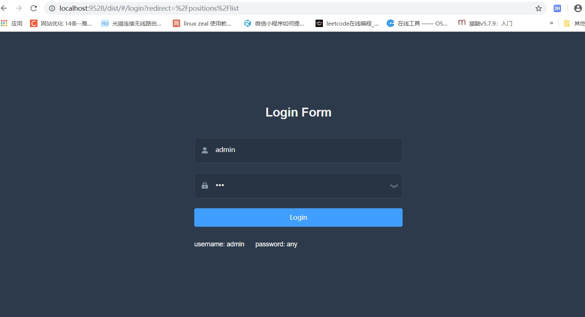
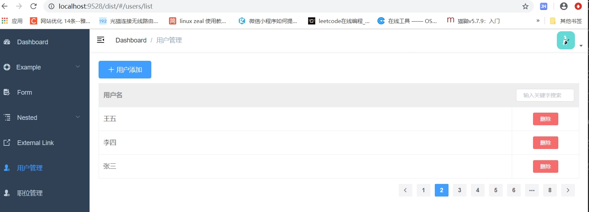
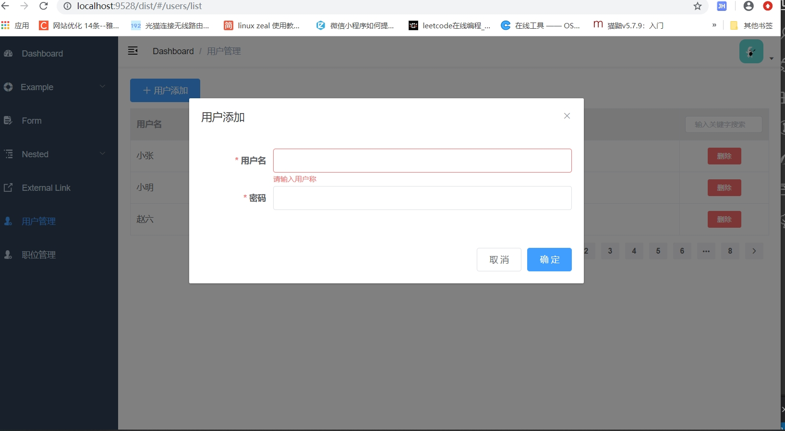
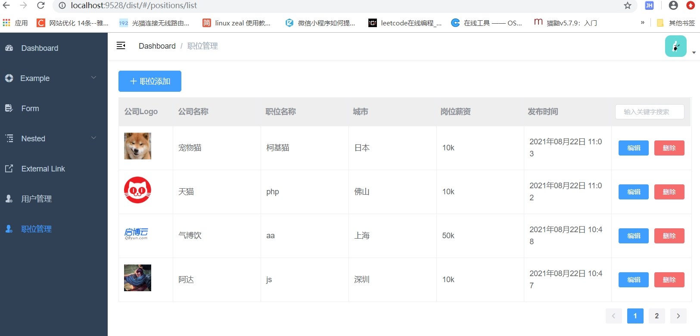

# lagou-admin

一个职位管理系统Demo, 前端使用art-template以及jquery实现, 后端基于nodejs,express+MongoDB实现。

## 实现的功能

1. 用户登录/注册
2. 用户列表/用户添加
3. 职位列表/添加/修改/职位删除

## 前端

### 项目运行

```powershell
# 安装依赖
yarn install

# 开发预览
yarn dev

# 打包发布
yarn build
```

### 页面展示

用户登录



用户列表

用户添加


职位列表/添加/修改/职位删除



## 后端

### 项目依赖

基于nodejs,express+MongoDB实现

### 项目运行

```powershell
# 安装依赖
yarn install

# 启动服务器
yarn start
```

